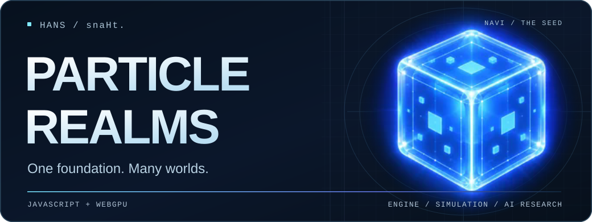
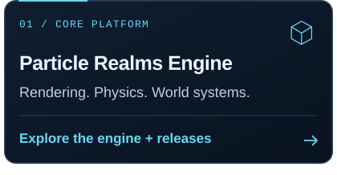
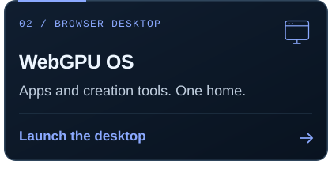
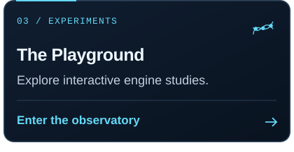
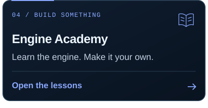

<!-- Particle Realms profile. Artwork is local; no counters, tracking pixels or remote stats services. -->

  

  <strong>Building the engine, the worlds, and the intelligence inside them.</strong> 
  <a href="https://particlerealms.online/playground/">Playground</a> &nbsp; · &nbsp;
  <a href="https://particlerealms.online/webgpu-os/">WebGPU OS</a> &nbsp; · &nbsp;
  <a href="https://github.com/BTSpaniel/particlerealms.engine/releases">Downloads</a>

## I'm Hans / snaHt.

I build **Particle Realms**: a browser-native foundation for games, creative tools, simulations, and AI. One shared platform instead of a different engine for every idea.

I want worlds you can build in, break apart, and teach.

### Explore what I'm building

  
  
  
  

  <a href="https://particlerealms.online/api/">API reference</a> &nbsp; · &nbsp;
  <a href="https://particlerealms.online/guide/">Guide</a> &nbsp; · &nbsp;
  <a href="https://github.com/BTSpaniel/particlerealms.engine-master-server">P2P server</a>

### The foundation

**JavaScript · WebGPU · WGSL · WebAssembly · PhysX · WebRTC**

Rendering, physics, audio, networking, and creation tools share the same foundation. The client runs on native browser APIs without a Node.js runtime; Python supports tooling and testing.

### Soul research

**What happens when the world becomes part of the training system?**

I'm exploring AI agents that learn through language, perception, interaction, and shared experience inside 2D and 3D worlds. Shared knowledge; individual identities and memories.

<strong>Souls, generations, and grounded language</strong>

The target is about **100 Souls in a 2D world and 100 in a 3D world**: observable populations that can learn, communicate, form relationships and families, and pass knowledge between generations.

A shared dictionary and learning system provide common ground. Each Soul retains its own context, personality, goals, and memories rather than becoming a copy of everyone else. Language should refer to what an agent can actually perceive, who it is talking to, and what they are doing together.

This is a **research direction, not a claim of finished artificial life or general intelligence**. The aim is measurable learning, persistent checkpoints, and worlds you can watch and interact with—not a scripted demo presented as a trained model.

<strong>Other work on the bench</strong>

**Realm Forge + RealmScript** — integrated creation tools and language/runtime research.

**Physical worlds** — particles, fluids, procedural materials, mechanical systems, and digital-twin experiments.

**Connected worlds** — peer discovery, synchronization, and shared spaces. The optional master server provides discovery and signaling, not gameplay authority.

**Creative tools** — experiments in music, modeling, books, and making things inside the platform.

These areas are at different stages of development. The engine documentation and individual releases are the reference for available capabilities.

---

  <strong>One foundation. Many worlds.</strong> 
  Render it. Simulate it. Teach it. Connect it.  
  <a href="https://particlerealms.online/">Particle Realms</a> · Hans / snaHt.

