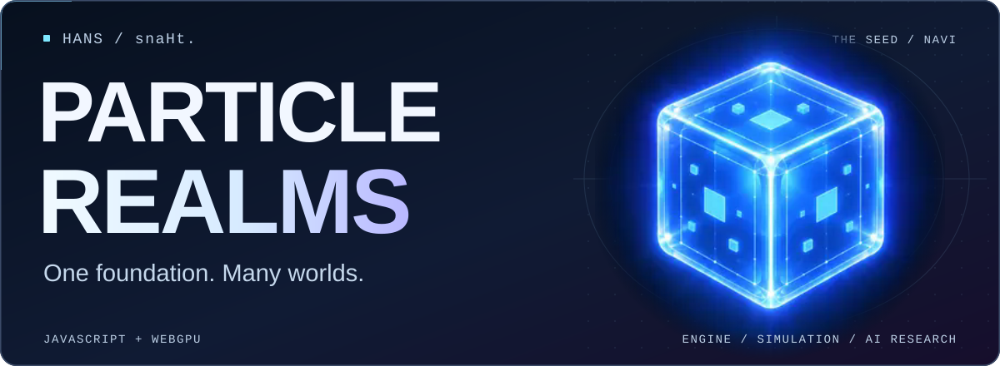

<!-- Particle Realms profile. Local artwork; no visitor counters, remote stats widgets, or analytics. -->

  <a href="https://particlerealms.online/">
    <picture>
      <source media="(max-width: 1000px)" srcset="assets/hero-mobile.svg" />
      
    </picture>
  </a>

  <strong>Worlds you can build in, break apart, and teach.</strong>  
  <a href="https://particlerealms.online/webgpu-os/"><strong>Launch WebGPU OS</strong></a> 
  <a href="https://github.com/BTSpaniel/particlerealms.engine">Engine source</a> &nbsp; · &nbsp;
  <a href="https://github.com/BTSpaniel/particlerealms.engine/releases">Downloads</a>

## Hans / snaHt.

I'm an independent engine and systems developer building **Particle Realms**: one browser-native foundation for games, creation tools, simulation, and AI. Not a different engine for every idea.

I build the tools I wish existed—and the worlds to test them in.

### Enter Particle Realms

  
  
  
  

  <a href="https://particlerealms.online/api/">API reference</a> &nbsp; · &nbsp;
  <a href="https://particlerealms.online/guide/">Guide</a> &nbsp; · &nbsp;
  <a href="https://github.com/BTSpaniel/particlerealms.engine/commits/">Source activity</a> &nbsp; · &nbsp;
  <a href="https://github.com/BTSpaniel/particlerealms.engine-master-server">Discovery &amp; P2P server</a>

### One platform. Connected systems.

**Engine → Editor → Plauna → AI runtime → WebGPU OS**

Rendering, physics, audio, networking, and creation tools share the same foundation. **Navi** is the operator-facing assistant.

**JavaScript · WebGPU · WGSL · WebAssembly · PhysX · WebRTC**

Native browser APIs at the core; no Node.js client runtime. Python supports tooling and testing. CPU/GPU parity is a design and validation goal, not a blanket claim about every subsystem.

### Can a world help teach an AI?

**Soul research** explores persistent software individuals learning through language, perception, interaction, and shared experience inside 2D and 3D worlds.

Shared knowledge. Individual identities, memories, and points of view.

<strong>The Soul experiment: worlds, language, and generations</strong>

The target is about **100 Souls in a 2D world and 100 in a 3D world**: populations you can observe as they learn, communicate, form relationships and families, and pass knowledge between generations.

A shared dictionary and learning system provide common ground. Each Soul keeps its own context, personality, goals, and memories rather than becoming a copy of everyone else. Language should be grounded in what an agent can perceive, who it is talking to, and what they are doing together.

This is **research in progress**, not a claim of finished artificial life or general intelligence. The goal is measurable learning and persistent training checkpoints—not a scripted simulation presented as a trained model.

<strong>Also on the workbench</strong>

**Realm Forge + RealmScript** — integrated creation tools and language/runtime research.

**Physical worlds** — particles, fluids, procedural materials, mechanical systems, and digital-twin experiments.

**Connected worlds** — peer discovery, synchronization, and shared spaces. The optional master server provides discovery and signaling, not gameplay authority.

**Creative tools** — experiments in music, modeling, books, and making things inside the platform.

These areas are at different stages. The engine documentation and individual releases are the reference for available capabilities.

---

  <strong>Build the foundation. Let people build the worlds.</strong> 
  <a href="https://particlerealms.online/">Particle Realms</a> · Hans / snaHt.

